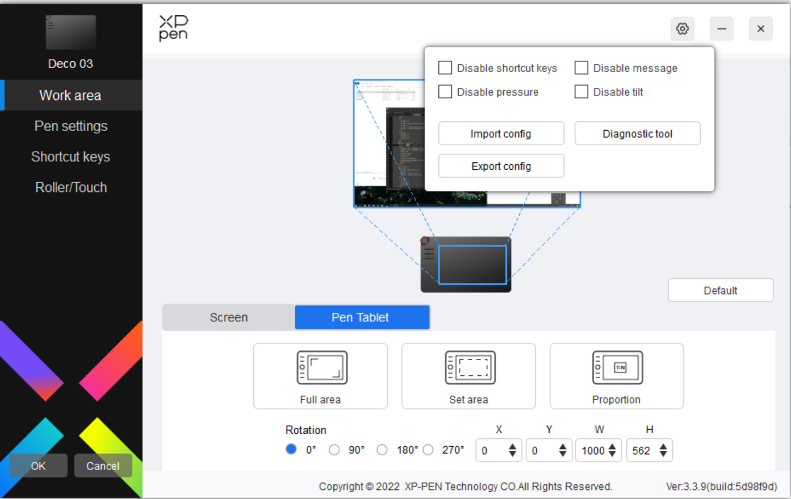
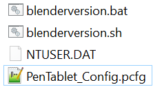
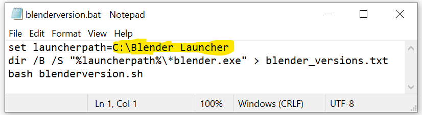
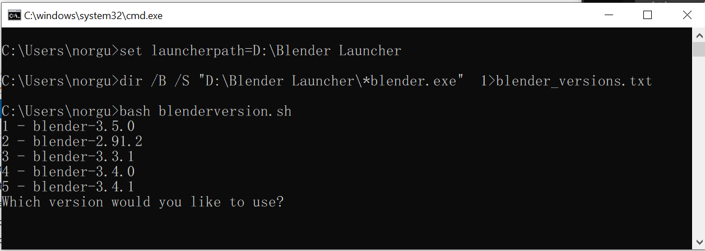

# XP Pen Tablet V3 Configuration Blender Version Switcher

I wrote this hacky script because I use multiple versions of [Blender](https://www.blender.org/) utilising [Blender Launcher](https://dotbow.github.io/Blender-Launcher/) with an [XP pen](https://www.xp-pen.com/download/index/) tablet and got fed up manually changing the configuration to point to the version of Blender I was using at a given time.

This is a personal project which I will explain once how to use, on this page, and will not be maintaining or providing support. I hope it's useful to at least one other person! Feel free to fork it or make something less insane and share that. Or to lobby XP pen to make less terrible software, that's also an option.

## Requirements
- Windows 10 or 11 (it would be easy to adapt for linux or mac native use if you are half way competent at the command line)
- WSL setup with a barebones linux distribution such as [Ubuntu](https://ubuntu.com/tutorials/install-ubuntu-on-wsl2-on-windows-11-with-gui-support)
- blenderversion.bat and blenderversion.sh from this project, stored in the same directory as an exported XP Pen config file
- the XP pen config file to be named "PenTablet_Config.pcfg"

## Insructions
- Export your pen tablet configuration by clicking the Cog icon top-right of the window and clicking 'Export config', giving it the name "PenTablet_Config.pcfg" - I reccommend the default location the dialog box opens in (%USERPROFILE%)

- Place blenderversion.bat and blenderversion.sh in the same location as "PenTablet_Config.pcfg"

- Ensure that your Blender Launcher path is correct for your install by editing blenderversion.bat in notepad

- Double click blenderversion.bat to update your exported configuration with the version of Blender you intend to use

- Type the number corresponding to the deisred Blender version (this will show any versions you have downloaded in a list) and press enter.
- Go back to the XP Pen software and this time click the cog and the 'Import config' button, choosing your newly updated "PenTablet_Config.pcfg"

That should be it, now it is relatively quick to switch versions of blender and keep your customised pen tablet configuration.

Make a shortcut to blenderversion.bat on your desktop, placing it next to the Blender Launcher shortcut for easy access.